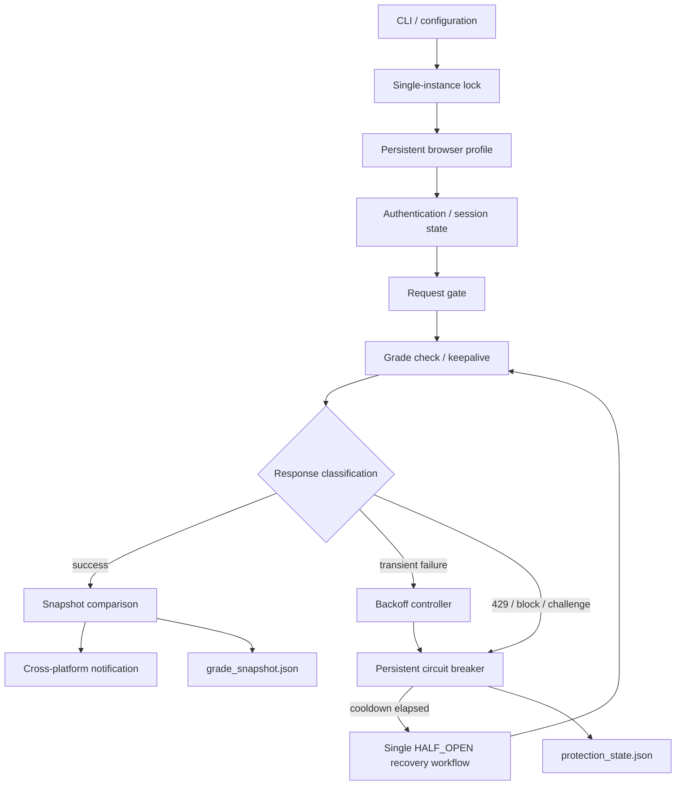

# whenTheAnswer

[](https://github.com/NRG-Wardog/whenTheAnswer/actions/workflows/ci.yml)
[](LICENSE)

**Reliability-focused, cross-platform BIU grade monitoring for Windows and Linux.**

`whenTheAnswer` is a Playwright-based monitoring utility designed around a deliberately conservative failure model. The interesting part of the project is not aggressive automation; it is the reliability layer around browser state, request pacing, persistence, rate limiting, recovery, and explicit stop conditions.

The watcher does **not** attempt to bypass CAPTCHAs, spoof fingerprints, evade anti-bot controls, or continue hammering an endpoint after a block. When the site signals blocking, rate limiting, or human verification, the system transitions into a persistent protection state and pauses work.

---

## Architecture



The project intentionally separates **request permission** from **request execution**: the request gate controls pacing and serialization, while the protection controller decides whether activity is allowed at all.

The implementation is also separated by responsibility: browser/session integration is isolated from reliability state, snapshot comparison, configuration, notifications, and runtime orchestration. `biu_grade_watcher.py` remains a thin compatibility CLI so existing commands and imports continue to work.

---

## Reliability Model

### Persistent circuit breaker

The protection controller uses three explicit states:

- `CLOSED` — normal operation;
- `OPEN` — checks and keepalives are paused until cooldown expires;
- `HALF_OPEN` — one serialized recovery workflow is allowed to test whether normal access has returned.

The state is persisted to disk, so restarting the process does not erase a cooldown caused by a block or rate-limit event.

### Conservative request pacing

The watcher enforces:

- one running process per user;
- no overlapping top-level BIU operations;
- minimum spacing between top-level requests;
- an hourly top-level request budget;
- jitter around recurring schedules;
- conservative lower bounds for grade and keepalive intervals.

### Explicit failure classification

The watcher distinguishes between:

- authentication/session expiry;
- transient server/network failures;
- explicit blocking statuses;
- rate limiting;
- blocking / CAPTCHA / human-verification page text.

`Retry-After` is honored when available.

### Controlled recovery

Transient failures use exponential backoff. Explicit protection events open the circuit for a longer cooldown. Once that cooldown expires, the system allows one controlled recovery workflow instead of immediately resuming normal polling.

---

## Protection Mechanisms

- Persistent Chromium profile and authenticated session
- Single-instance process lock
- Serialized top-level BIU operations
- Minimum request spacing
- Hourly request budget
- Randomized scheduling jitter
- Detection of HTTP `403`, `406`, `418`, `423`, and `429`
- Detection of blocking, CAPTCHA, and rate-limit text
- `Retry-After` parsing
- Persistent `CLOSED / OPEN / HALF_OPEN` circuit breaker
- Exponential backoff for transient failures
- Controlled recovery probe after cooldown
- Authentication-attempt budget
- No repeated automatic OTP attempts
- Persistent state across restarts
- Cross-platform notifications
- No stealth/fingerprint-spoofing browser flags

---

## Repository Layout

```text
whenTheAnswer/
├── biu_grade_watcher.py      # thin CLI + compatibility import surface
├── watcher/
│   ├── config.py             # constants, paths, safety limits
│   ├── errors.py             # typed failure/protection events
│   ├── reliability.py        # lock, request gate, auth budget, circuit breaker
│   ├── snapshot.py           # grade identity, persistence, diffing
│   ├── browser.py            # Playwright auth/navigation/extraction boundary
│   ├── runtime.py            # watcher orchestration + keepalive loop
│   └── utils.py              # logging, notifications, JSON/time helpers
├── tests/                    # deterministic reliability tests
├── .github/workflows/ci.yml  # cross-version Python validation
├── env.example               # local configuration template
├── requirements.txt
├── LICENSE
└── README.md
```

This split keeps deterministic reliability and state-management logic independent from the live browser integration. The external-site boundary remains in `watcher/browser.py`, while orchestration is coordinated from `watcher/runtime.py`.

---

## Tests and CI

The deterministic test suite covers core reliability behavior without contacting BIU or launching a browser:

- text normalization;
- `Retry-After` parsing for seconds and HTTP dates;
- transient failures opening the persistent circuit after the configured threshold;
- rate-limit/protection events recording status and cooldown state;
- state persistence across controller reloads;
- successful recovery resetting the circuit;
- rejection of activity while the circuit remains open.

Run locally:

```bash
python -m pip install -r requirements.txt
python -m unittest discover -s tests -v
```

GitHub Actions also runs compile validation and these tests across multiple supported Python versions.

Browser integration remains intentionally separate because it requires external authentication and live website behavior.

---

## Installation

### Windows

```powershell
py -3.10 -m pip install -r requirements.txt
py -3.10 -m playwright install chromium
```

### Linux

```bash
python3 -m pip install -r requirements.txt
python3 -m playwright install chromium
python3 -m playwright install-deps chromium
```

Desktop notifications on Debian/Ubuntu:

```bash
sudo apt install libnotify-bin
```

---

## Configuration

Create `.env` next to the script:

```env
BIU_ID=123456789
BIU_PHONE=0501234567
```

The OTP is entered interactively and is not stored.

---

## Recommended Run

### Windows

```powershell
py -3.10 biu_grade_watcher.py `
    --auth-method direct `
    --interval 10 `
    --keepalive 2
```

### Linux

```bash
python3 biu_grade_watcher.py \
    --auth-method direct \
    --interval 10 \
    --keepalive 2
```

Actual execution includes small random jitter so recurring operations do not always occur on an exact fixed boundary.

---

## One-Time Validation

```bash
python3 biu_grade_watcher.py \
    --auth-method direct \
    --force-login \
    --once \
    --print-rows
```

On Windows, replace `python3` with the Python launcher/runtime available on the machine.

---

## Inspect Protection State

```bash
python3 biu_grade_watcher.py --protection-status
```

Example:

```json
{
  "circuit_state": "OPEN",
  "consecutive_failures": 0,
  "opened_count": 1,
  "cooldown_until": "2026-07-24T18:00:00+00:00",
  "last_reason": "grade check returned HTTP 429.",
  "last_status": 429,
  "seconds_until_probe": 1620
}
```

Only clear the persistent state after confirming the site is accessible normally in a regular browser:

```bash
python3 biu_grade_watcher.py --clear-protection-state
```

---

## Stored State

### Windows

```text
%LOCALAPPDATA%\BIUGradeWatcher
```

### Linux

```text
$XDG_DATA_HOME/biu-grade-watcher
```

or:

```text
~/.local/share/biu-grade-watcher
```

Runtime files include:

```text
browser_profile/
grade_snapshot.json
protection_state.json
watcher.log
watcher.lock
```

---

## Safety Limits

Default behavior is intentionally conservative:

```text
Grade check interval: 10 minutes
Keepalive interval: 2 minutes
Minimum top-level request gap: 12 seconds
Maximum top-level operations: 45 per hour
```

The script refuses a grade interval below 5 minutes, a keepalive interval below 2 minutes, or more than 60 top-level operations per hour.

---

## Design Principles

- **Respect external controls**: a block is a stop condition, not a challenge to bypass.
- **Persist failure state**: process restarts should not erase safety behavior.
- **Serialize recovery**: recovery should happen through one controlled workflow.
- **Fail visibly**: protection state, reason, status and cooldown remain inspectable.
- **Separate external I/O from deterministic logic**: browser behavior is isolated from state, pacing, and snapshot rules.
- **Keep compatibility at the boundary**: the original CLI remains stable while internals are modularized.

---

## Known Limitations

- Live browser behavior depends on an external university website and can change independently of this repository.
- Authentication and full end-to-end browser integration cannot be reproduced in public CI without real credentials and live external access.
- Browser selectors and authentication flows remain coupled to the current BIU site and require maintenance when the external UI changes.
- This is a personal monitoring utility, not an official BIU integration.

---

## License

MIT — see [LICENSE](LICENSE).
